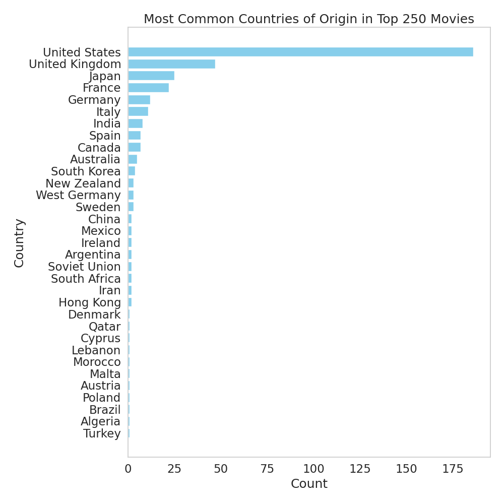

# IMDB Top 250 - Exploratory Data Analysis

IMDB (Internet Movie Database) is one of the largest online databases for movies and television shows, providing comprehensive information about movies, including ratings and reviews from its vast user base. The IMDB ratings are widely used as a benchmark for the popularity and success of movies. The dataset that we used contains the top 250 rated movies on IMDB as of 2023, providing a snapshot of the most popular and highly rated movies of recent times. 
**Kaggle:** https://www.kaggle.com/datasets/ashishjangra27/imdb-top-250-movies  
## Collaborators
- Prakhyath Bagavatula: [Prakb2401](https://github.com/Prakb2401) 
- Ramnath Gowrishankar: [raamnath025](https://github.com/raamnath025)
## Technologies Used
- Python
- Pandas
- Numpy
- Jupyter
- Seaborn
- Matplotlib
- Sklearn
- [OMDb API](https://www.omdbapi.com/)
## Project Overview
By analyzing this Kaggle dataset, one can gain insights into the movie industry, such as trends in movie ratings and popular genres. For this project, we utilized IMDB's Top 250 list and the OMDb API to perform an exploratory data analysis project.

We conducted the project by addressing the following guiding questions:

1. **Identify the most popular genres in the top 250 list.**
    - What are the most common genres of movies that appear in the top 250 list? 
    - Are there any genres that are underrepresented?
2. **Identify the most common countries of origin for movies in the top 250 list.** 
    - Which countries produce the most movies that make it into the top 250 list? 
    - Are there any countries that are underrepresented?
3. **How does the distribution of movie ratings differ by genre?**
    - Are there any genres that are consistently rated higher or lower than others?
    - Are there any particular genres that have a wider range of ratings, or are most movies in a particular genre rated similarly?
4. **Analyze the distribution of runtimes for movies in the top 250 list.** 
    - How long are most movies in the top 250 list?
    - Are there any particular genres that tend to have longer or shorter runtimes?
5. **Clustering Movies:** 
    - Use unsupervised machine learning techniques (e.g., K-means clustering) to group movies based on their attributes, such as genre and runtime. 
    - What clusters emerge, and can you interpret the characteristics of each cluster?

## Conclusions
1. **Identify the most popular genres in the top 250 list.**  
    - The most common genres of movies that appear in the top 250 list are Drama, Adventure, and Action. 
    - Genres such as Family, Fantasy, Sci-Fi, History, Romance, and Horror are underrepresented in the top 250 list. 

  

2. **Identify the most common countries of origin for movies in the top 250 list.**  
    - The United States produces the most movies that make it into the top 250 list, with over 150 movies. The United Kingdom is the second most common country of origin, contributing around 50 movies, followed by France and Germany, each with around 20-25 movies. 
    - Countries such as Italy, Japan, India, Canada, Australia, and Spain are underrepresented in the top 250 list.

  

3. **How does the distribution of movie ratings differ by genre?** 
    - Drama and Adventure genres tend to produce highly rated movies, with median ratings around 8.2 and 8.1 respectively. Animation also shows a consistent performance in producing highly rated movies, with a median rating around 8.3. Conversely, Biography and History genres, while appreciated by audiences for their historical content, have slightly lower median ratings around 8.0 compared to genres like Drama and Adventure. 
    - Certain genres exhibit a wider range of ratings, indicating variability in movie quality. Specifically, Drama, Adventure, Action, Crime, and Thriller genres show this trend. However, Animation, Comedy, and Mystery genres demonstrate more consistent ratings, suggesting similar quality across movies within these genres. 

  

4. **Analyze the distribution of runtimes for movies in the top 250 list.** 
    - Most movies in the top 250 list have runtimes around 120-130 minutes. Shorter movies (less than 100 minutes) and longer movies (greater than 150 minutes) are less common, and very long movies (greater than 200 minutes) are quite rare. 
    - The visual does not provide information about the runtimes of specific genres. To determine if there are any particular genres that tend to have longer or shorter runtimes, we would need to create additional visuals or perform further analysis that takes into account both the genre and runtime of the movies. 

  

5. **Clustering Movies:** 
    - Unsupervised machine learning, specifically K-means clustering, was used to group movies based on their attributes. The attributes considered for clustering are 'Runtime', 'Metascore', and 'imdbRating'. The analysis reveals five distinct clusters, each with unique characteristics in terms of runtime, Metascore, and IMDb rating. 
    - The clusters suggest that there are groups of movies that share similar characteristics in terms of runtime, Metascore, and IMDb rating. The clusters range from shorter to longer movies, and from good to very high ratings and metascores.
    
  
